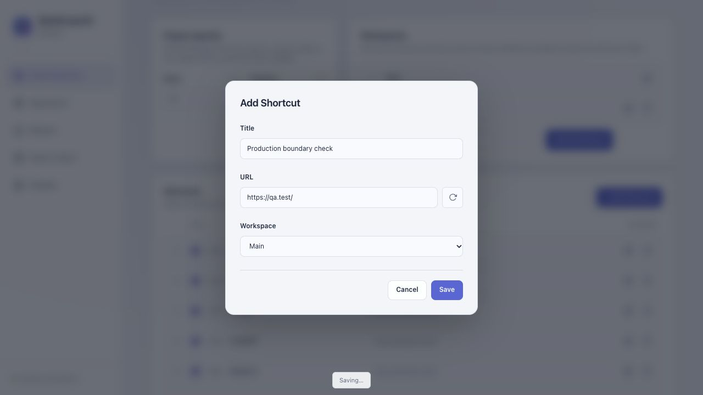

# QuickLaunch production review follow-up

September 30, 2026. **Local code fixes are complete; hold Store submission until the installed-Chrome acceptance gates are complete.** This is the current production review. Earlier reports describe historical checkpoints, not proof that every production boundary had been tested.

## Why the previous review missed these defects

The previous 68 tests mostly completed storage reads/writes immediately. They did not exercise an editable page before its first read, repeated actions against a stale rendered list, callbacks arriving after mode changes, or native focus loss during control locking. The mock also failed to expose callback-scoped `runtime.lastError` through its separate UI runtime object. Passing those tests was insufficient evidence of readiness.

Added controlled delays, genuine callback error semantics, popup teardown, legacy-state fixtures, hostile parser inputs, and packaging failure injection. Tests use the actual first-party UI handlers and background modules. They remain simulations of Chrome APIs and do not replace installed-browser acceptance.

## Findings fixed in this round

| Priority | Failure and evidence | Correction |
| --- | --- | --- |
| P1 | Settings accepted a change before its initial read. The delayed-read reproduction changed rows to 7 and replaced saved columns, theme and two workspaces with defaults and an empty workspace list. | Saved data loads and renders before controls become interactive. Storage also refuses writes/drafts before readiness. A failed initial read remains unavailable. |
| P1 | Popup quick-start during loading replaced two existing shortcuts with one onboarding shortcut. | The same startup gate protects both pages, including keyboard and queued/synthetic events. |
| P1 | Two clicks on a stale Settings Delete row during a delayed save removed both A and neighboring B, for shortcuts and snippets. | Collection saves lock interaction until completion. Delete actions resolve the original object or snippet ID rather than a captured array index. |
| P1 | A pending dialog could be canceled and replaced with another draft; its old completion callback could close the new editor. | Collection editors and surrounding controls remain inert during commit, with a visible Saving status. Success releases interaction before restoring editor focus; failure keeps recovery focused. |
| P1 | A simulated native blur during locking reversed two queued saves: the later inline rename was overwritten by the earlier deletion snapshot. The regression failed with title A instead of Renamed A. | Establish queue order before setting inert, since focus-loss handlers can enqueue synchronously. The final state retains both the deletion and rename. |
| P2 | Settings shortcut editors used old array positions; old row handles could crash or address a different record after deletion. A removed snippet could announce a no-op save. | Keep the shortcut object identity, check that targets still exist, and reject missing snippets. Drag drops also validate connected source/target nodes and current identities before committing. |
| P2 | Delayed active-tab and snippet-draft callbacks opened the wrong sheet after switching mode/workspace. Both mode-switch reproductions failed before the fix. | Invalidate outstanding requests when navigation/cancel/edit context changes. Active-tab requests capture the chosen workspace; obsolete responses cannot reopen an editor. Stored draft fields are type-checked. |
| P2 | Deleting the final copy of a URL saved usage counts separately from shortcuts. Injecting a shortcut-only failure erased its count while preserving the shortcut. | Write the shortcut collection and related count removal in one checked storage request. |
| P2 | A synchronously invalidated launch channel left launch controls stuck. Clipboard callback errors could report successful removal or leave a misleading toggle. | Catch synchronous and asynchronous launch failures, restore controls, consume callback lastError in scope, recheck actual permission state, and keep failed permission checks unavailable. Quick Add and opening Settings also report API failures. |
| P2 | A fresh export omitted both collections and could not be imported. Exports following another window's reset resurrected the current editor's stale settings. | Both pages use a shared export builder based on the latest committed snapshot, with explicit empty collections and validated committed/default preferences. |
| P2 | Snippet merge repeatedly scanned all preceding snippets, making bulk deduplication quadratic. | Use content and ID sets while preserving order, content deduplication and ID collision behavior. Reject an ID generator collision rather than creating a record lost on reopening. Settings previews retain only a short text excerpt in the list; saved/copied content remains intact. |
| P3 | A grouping failure replaced an existing partial-tab warning, and count-save failure could be hidden. | Return all applicable warnings together, while preserving successfully opened tabs. Notification denial remains non-fatal to saving. |
| P2 | The delayed startup animation frame could focus Search after the user opened a snippet editor, redirecting subsequent typing. A controlled animation-frame regression failed before the correction. | Autofocus only when no sheet is open, no save/recovery is active, and focus is still on the body. User-selected focus is preserved. |

The earlier object-key ordering correction remains intact: canonical comparison ignores object field insertion order, preserves array order, accepts legacy expected JSON, and rejects real content changes. Genuine conflicts still require reload rather than retrying stale whole collections. Recovery now explicitly explains that reload discards unsaved edits; it does not promise a failed message could never have committed.

## Review coverage

Reviewed first-party startup/rendering and editor lifecycle in `popup.js` and `options.js`; validation/export/import in `backup.js`; UI readiness, queue ordering, recovery and teardown in `storage.js`; canonical values and checked worker commits in `storage-value.js`/`storage-worker.js`; context-menu, launch, counts, notifications and message authorization in `background.js`; placeholder expansion in `snippet.js`; cached ranking in `search.js`; HTML bindings, shared CSS, manifest/CSP and packaging.

Checked native API assumptions against [runtime/lastError](https://developer.chrome.com/docs/extensions/reference/api/runtime), [optional permissions/user gestures](https://developer.chrome.com/docs/extensions/reference/api/permissions), [asynchronous local storage and quotas](https://developer.chrome.com/docs/extensions/reference/api/storage), and [worker shutdown rules](https://developer.chrome.com/docs/extensions/develop/concepts/service-workers/lifecycle). Permission requests remain directly inside a user gesture. Notifications retain callback compatibility with the Chrome 114 minimum. No host permissions, remote scripts or analytics were added.

The bundled versions are Marked 15.0.12 and Highlight.js 11.9.0. Reviewed upstream advisories separately from npm audit: [Marked's 2026 recursion advisory](https://github.com/markedjs/marked/security/advisories/GHSA-6v9c-7cg6-27q7) lists 18.0.0/18.0.1; the [older Marked definition](https://github.com/markedjs/marked/security/advisories/GHSA-rrrm-qjm4-v8hf) and [reference-link](https://github.com/markedjs/marked/security/advisories/GHSA-5v2h-r2cx-5xgj) advisories list pre-4.0.9 releases; [Highlight's grammar advisory](https://github.com/highlightjs/highlight.js/security/advisories/GHSA-7wwv-vh3v-89cq) lists 9.x and releases through 10.4.0. Tested the whitespace payload and representative hostile inputs under a hard VM deadline. A real deeply nested input throws in the bundled parser; the application falls back to complete literal text and still copies it correctly. This is targeted validation, not a guarantee against every parser/grammar input. Vendor upgrades need renewed advisory and regression review.

## Evidence and verification

- **96 regression tests** passed in the gated build re-run on October 2. This round adds 28 tests, including 22 production-boundary cases, three backup cases, two legacy-state/worker-restart cases, and one bounded vendor-input test. Test files run sequentially so parallel DOM fixtures do not exhaust the parser's unchanged one-second VM deadline on a busy machine.
- Syntax, packaged references, HTML ID uniqueness and literal JavaScript element bindings, dependency order, worker imports, manifest expectations, reserved root names and whitespace are checked before packaging.
- `npm audit --audit-level=high` and `npm audit --omit=dev` each reported zero known vulnerabilities. This covers npm dependencies; bundled vendor assets were reviewed separately above.
- Rechecked the submitted 2.6 archive hash: `d0239707c0475fa67f407992dc119b51597fd5cdb002f7b6a783a6f98ece94ad`. Synthetic fixtures use its stored data shape. Reads/update-menu initialization leave stored content untouched; preference saves and a new worker preserve content, IDs, whitespace, drafts, counts and selected view state.
- Local Node/VM benchmark: 8,000 synthetic snippets, 540,684-byte JSON payload. Median of three measured runs after one warmup: previous snippet-deduplication path **865.4 ms**, current complete merge **19.9 ms**. Different operation scopes are intentional: the new measurement includes validation and the full merge, while the old one isolates its expensive snippet scans. These are machine-specific timings, not native browser startup measurements.
- Rendered the actual UI with synthetic APIs: ten-second initial storage delay shows only Loading saved data and then restores search focus; a 2.5-second save makes the dialog inert and announces Saving, then restores interaction, closes the editor and renders the saved row. No warning/error console entries occurred on that completed save path.
- Native Brave: reloaded the existing unpacked extension from this workspace, opened Settings with the saved rows/columns and existing records, and saved an existing shortcut without changing its title/URL. Save completed, closed the editor, restored focus and displayed Saved. Existing Appearance preferences remained selected. Native Export downloaded a 32.7 KB JSON backup and reported Done. The in-app browser's download event waiter timed out, so that adapter attempt is not recorded as successful download verification.
- Native records were not deleted/reset or replaced with test fixtures. No clipboard permission was granted, no real snippet was copied, and no Store upload/publication occurred. Temporary QA browser tabs were closed.

### Package gate

`npm run package` and direct `python3 scripts/package.py` now run tests and structural checks **before** creating a ZIP. The allowlist now contains 26 files, including the added Feather icon license. Tests, fixtures, reports, screenshots, promotional assets, development dependencies and private data stay outside the archive. ZIP integrity and every packaged byte are checked against source; archive/per-file hashes are generated alongside it.

Fault injection in isolated temporary directories proved that an intentionally failing regression and a missing `rows` DOM binding each stop the builder without creating an archive. Evidence: [release-gate-faults-2026-09-30.json](release-gate-faults-2026-09-30.json). An older already-existing ZIP can still exist after a failed rebuild; always check the builder result and approved hash rather than assuming a filename is current.

The final ZIP hash is recorded in [the main review](REVIEW_2026-09-30.md) and `dist/quicklaunch-v2.7.sha256`.

## Remaining gates and limits

**Do not submit yet.** The native Brave checks are focused integration evidence, not a clean normal-Chrome acceptance run of the extracted final ZIP. Complete [STORE_RELEASE.md](../STORE_RELEASE.md), particularly:

1. Load the extracted final archive in a clean normal-Chrome profile, inspect popup/options/worker and CSP errors, and test an actual 2.6-to-2.7 update at the same extension identity with representative data.
2. Exercise Save/close/reopen/restart, worker suspension and current-tab/workspace launches, plus drag cancel/scroll and System/reduced-motion behavior. A Node teardown/restart fixture cannot prove native worker persistence across a browser crash/restart.
3. Handle actual clipboard deny/grant/revoke prompts and read failure. Permission grants need the user's explicit action. Confirm plain copying, placeholders and repeated-copy mode without losing the original clipboard on failure.
4. Verify native download/restore against synthetic data in Chrome, plus activeTab/favicons/context-menu/group failures and OS notification denial. The successful native Brave download does not prove restoration into Chrome.
5. Align public privacy policy, Store screenshots and disclosures with the approved candidate; verify the final hash before submission.

Capacity remains Chrome local storage's quota; backups are limited to 5 MB. Large collections still render full Settings/snippet lists. Native profiling near capacity and windowed list rendering are future performance work, not results established by the import benchmark. Real concurrent content changes intentionally pause a stale editor; record-level mutations and stable shortcut IDs could reduce those reload interruptions in a later, separately tested change. Reload recovery does not preserve unsaved Settings drafts. Unexpected browser/OS termination can interrupt outstanding operations, so no universal zero-bug or crash-proof claim is made.

## Rendered evidence

Synthetic delayed save, with controls frozen until completion:

Native Brave save/export captures are retained locally and excluded from the public repository because they include the user's browser context. The focused native results are described above.
