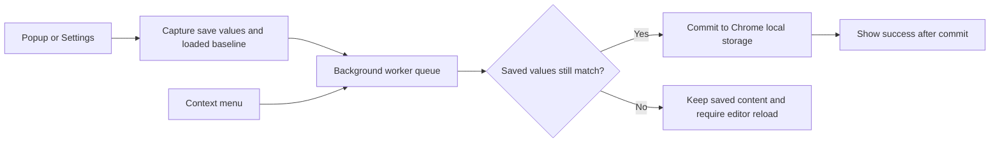
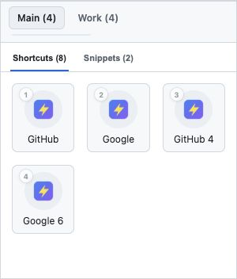
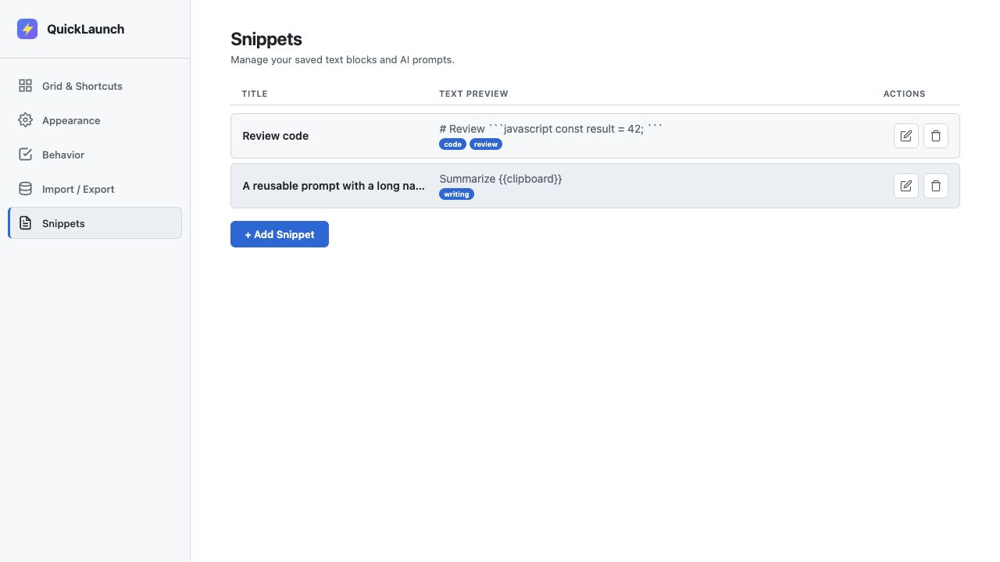
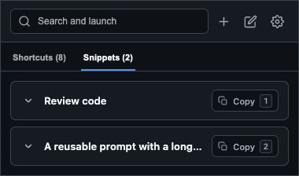
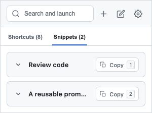

# QuickLaunch review and 2.7 release candidate

Initial review September 30, 2026; current artifact verified October 2. **Store submission remains gated on normal-Chrome acceptance checks.** See the [production follow-up](PRODUCTION_REVIEW_2026-09-30.md) for the additional delayed-operation defects and the [policy review](POLICY_REVIEW_2026-10-02.md) for current licensing and disclosure work. The original 2.6 implementation had reproducible data-loss and clipboard-integrity bugs.

## What was actually reviewed

- [Published Store listing](https://chromewebstore.google.com/detail/quicklaunch/dihfnkdobkjncafdlhephnongepaiphf): version **2.6**, updated **September 26, 2026**, one visible screenshot, no ratings at review time.
- Submitted archive `quicklaunch-v2.6-store-fixed.zip`: SHA-256 `d0239707c0475fa67f407992dc119b51597fd5cdb002f7b6a783a6f98ece94ad`. All **19 entries** match the currently fetched public GitHub `main`, commit `8fd1b8ebd7e86ede0478ec471be98a8af2939785`.
- Every first-party runtime JS, HTML and CSS file, manifest, bundled library headers and upstream security advisories, privacy disclosures, release notes, and the existing backup tests.
- The working checkout already contained UI changes beyond the submitted archive. These were preserved; the initial dirty state was recorded and a binary patch saved at `/tmp/quicklaunch-before-review-20260930.patch`.
- The Store metadata and submitted-source provenance were verified. The installed Store CRX was not downloaded or independently fingerprinted.

## Findings and fixes

Priority means potential user impact: P1 = saved-data/content integrity; P2 = a broken flow or material performance/reliability problem; P3 = usability/maintainability.

| Priority | Finding and concrete trigger | Evidence | Fix in candidate |
| --- | --- | --- | --- |
| P1 | A settings tab loads shortcuts, a right-click action adds a new shortcut, then the stale settings tab saves its old array and erases the new shortcut. | Reproduced against archived 2.6. | All mutations pass through one worker queue and compare the editor's loaded state with current saved values. A conflict stops the save and asks for reload. `storage.js`, `storage-worker.js`, `background.js`. |
| P1 | Two overlapping context-menu additions independently read the same array; the second write loses the first addition. | Reproduced with the archived background script. | Serialize read/modify/write operations in the worker. A failed operation does not poison the queue. |
| P1 | A snippet containing `{{clipboard}}` still writes to the clipboard when permission is denied, replacing the token with empty text and overwriting the original clipboard. | Reproduced against archived 2.6; failure originally followed by a success toast. | Stop copying on missing permission/read failure. Copy only after all required inputs resolve. `snippet.js`, `popup.js`. |
| P1 | JavaScript replacement strings interpret `$&`, `$'`, `$\`` and `$$` in clipboard contents rather than preserving literal text. Clipboard text may also contain apparent template tokens. | Old string replacement path; regression with all patterns and nested tokens. | Expand original tokens through a replacement callback; inserted clipboard content is opaque. |
| P1 | Save failures leave mutated in-memory arrays and some settings callbacks announce success without checking the failed write. A later successful save can include those unsaved mutations. | Storage quota/read failures injected into real UI handlers. | Success callbacks run only after a successful checked commit. On failure the editor stops accepting further saves until reload; the modal remains open and persistent recovery instructions appear. |
| P1 | Editing a popup shortcut by its array index can edit the wrong item or do nothing after another tile is deleted/reordered while its sheet is open. | Regression deletes the preceding tile before Save. | Retain the actual edited object and verify it still exists. Snippet edits also reject a removed target instead of reporting a no-op save. |
| P2 | Popup tab-group work depends on the short-lived popup and opens all tabs in parallel, with weak failure handling and counts incremented before successful opens. | Source inspection; partial tab/group failure simulation. | Worker owns the whole launch, creates tabs sequentially in the captured Chrome window, counts only successful opens, and reports partial failures. UI prevents repeated launch clicks. |
| P2 | All collapsed snippets parse Markdown and highlight code each time the list renders. Large or malformed content can block or break the popup. | Archived 2.6 reproduction and rendering benchmark below. | Preview work happens on first expansion and is cached for that card. Markdown over 100,000 characters uses plain text; code over 20,000 characters stays unhighlighted. Highlight only declared languages; parser exceptions fall back to text. |
| P2 | Numeric hotkeys can run with Alt/Cmd/Ctrl modifiers or while an edit sheet is open; arrow navigation assumes a remembered index rather than the item actually focused. | Real UI handler regressions. | Guard modifiers, composition, repeat and open editors; derive navigation from actual focus. Snippets also have focusable cards and explicit keyboard copy controls. |
| P2 | Searching for `1xyz` is interpreted as numeric shortcut 1. Numeric search also uses manual order while the visible grid may be sorted. | Regression under A–Z sorting. | Numeric matching requires one exact digit and uses the active workspace's selected sort order. |
| P2 | Switching an empty shortcuts view to snippets can leave shortcut onboarding visible; rerendering after an import can reveal shortcut UI in snippets mode. | DOM-state regression. | Render only the active mode; hide onboarding/tabs/quick-add state appropriately and update button labels/count semantics. |
| P2 | Ten configured columns at the 300px minimum popup width overlap icons and make titles unreadable. | Seen in actual browser rendering before the fix. | Adapt the number of rendered columns to popup width, gap and icon size; retain configured capacity. Keyboard row movement uses the adapted column count. |
| P2 | Same-URL shortcuts in different workspaces are allowed in some flows and blocked/dropped in others. | Source review and cross-workspace merge/menu tests. | Scope duplicates by URL plus workspace for quick add, chips, edits, context menus and import. |
| P1 | A snippets-only restore silently deletes all shortcuts; fully empty collections cannot be restored; a malformed collection can erase good existing data alongside a valid collection. Partial settings restore can move preserved shortcuts out of their workspace. | Pure import regressions, including wrong collection types and conflicting workspace settings. | Preserve omitted collections, support explicit empty arrays, reject malformed or wholly invalid collections, and reject partial restores that would remove workspaces still used by preserved shortcuts. |
| P2 | Import merges silently drop colliding timestamp snippet IDs or assign imported shortcuts to the wrong workspace when workspace IDs collide; capacity overflow is silently truncated. | Collision/overflow regressions. | UUIDs for new records; remap colliding workspaces and preserve distinct snippets. Reject overflow instead of silently moving items. Exact duplicate content is skipped. |
| P2 | Reimporting a backup adds usage counts repeatedly, and exports can omit the separately stored search-bar position or export stale UI state. | Merge idempotence and committed-state export regression. | Merge usage counts with `max`, export fresh committed data, include search position, current version and timestamp. Limit import files to 5 MB before reading. |
| P2 | Debounced new-snippet drafts lose recent typing when the popup closes. Saving text also strips meaningful leading/trailing whitespace. | Immediate-input persistence and exact-whitespace regressions. | Submit drafts as input changes; preserve snippet text exactly while still rejecting whitespace-only content. |
| P3 | Icon-only actions are ambiguous to assistive technology, snippets have no dedicated keyboard copy action, modal focus can escape, and feedback is not announced. | DOM checks and browser accessibility snapshots. | Descriptive action labels, preview expanded state, explicit Copy buttons, dialog focus containment/return, live status messages and document language. |
| P3 | Drag handlers can continue auto-scroll after focus leaves the window; snippet drag starts on non-left mouse buttons and on action controls. | Source inspection. | Cancel on window blur and remove the listeners; guard mouse buttons/action elements and scope drop targets. Native pointer acceptance remains pending. |
| P3 | README promises controls/search behavior that the reviewed baseline did not provide. Release packaging has no reusable allowlist. | Source/docs comparison. | Correct feature descriptions; add regression scripts, syntax/reference checks, an explicit 25-file packaging allowlist and per-file hashes. The follow-up now implements ranked search. |

The subsequent user-reported conflict exposed a bug introduced in the candidate's guard: raw JSON comparison treated object-field reordering as a content change. Shared canonical comparison now ignores object-key order while retaining array/value conflicts. The original mock missed storage reordering; every mocked storage read now exercises it. See [the fix and native Brave verification](STORAGE_CONFLICT_FIX_2026-09-30.md). Native reload also exposed `_promo` as an invalid unpacked-extension folder name; assets were preserved under `promo/`.

## Storage design and tradeoffs

Checks are per touched storage key, so concurrent changes to separate collections can succeed. The selected workspace is view state and uses last-writer behavior. Temporary new-snippet drafts also use last-writer behavior; saving a snippet clears its matching draft atomically, preserving a different draft from another view. Whole-array conflicts intentionally require a reload rather than automatically trying to merge an edit into an uncertain item/order. This is conservative and protects saved content, but two users/views editing different records in the same collection can still encounter a reload request. Unsaved edits to existing records are not promised to survive a reload. A later improvement can add stable shortcut IDs and record-level conflict handling.

The worker queue is the only first-party mutation path. Storage continues to use the existing keys and shapes; no destructive data migration is performed. The archive's 2.6 data is covered by the validators/import paths, but an installed-extension upgrade/restart must still be checked in Chrome.

Once a launch request reaches the worker, popup closure does not own the remaining tab/count work. Native Chrome lifecycle behavior has not yet been certified in this review. Drafts dispatch immediately instead of waiting behind UI callbacks, avoiding popup debounce loss at the cost of extra storage/message work while typing; very large drafts should be profiled before adding richer editing features. Malformed null shortcut entries do not block valid workspace launches.

## Performance evidence

Synthetic benchmark: Node 24.16.0 + jsdom 26.1.0, 200 collapsed snippets containing a heading and 100 repeated Markdown lines each. Measured synchronous mode-switch handler time on this machine, one comparison run.

| Version | Handler time | Markdown parses before expansion |
| --- | ---: | ---: |
| Archived 2.6 | 902.7 ms | 200 |
| Candidate 2.7 | 33.4 ms | 0 |

Run `node scripts/benchmark.cjs` to repeat. These are DOM/JavaScript measurements, **not normal-Chrome latency, memory measurements, or a guarantee of 27x overall extension speed**. Lazy previews also avoid work on cards the user never expands. The runtime still eagerly loads both bundled parsing libraries; loading them only on the first preview is a worthwhile next optimization after native startup measurement.

Grid/snippet renderers now use a map of original indices rather than repeated `indexOf()` searches. This removes avoidable quadratic index lookup during large-list rendering. Entrance delay is capped. Tabs open sequentially rather than flooding Chrome with simultaneous create calls.

## Security and privacy assessment

- Manifest V3; no host permissions, content scripts, externally connectable endpoint, telemetry, network data service, remote-code fetch, `eval`, or `new Function` path in first-party runtime code.
- Existing permissions are retained; clipboard read remains optional and requested from Settings on a user action. No new permission has been added for 2.7.
- Runtime write/launch messages require a sender belonging to this extension's own pages. Mutation keys/operation types are allowlisted.
- Imported URLs remain HTTP(S) only, and explicit non-web schemes entered in forms are rejected rather than prefixed into misleading web URLs.
- Cached favicon paths remain local. Custom icons accept only the existing raster data-image formats; remote/SVG values are inert/removed by validation.
- Markdown raw HTML and image tokens are escaped, generated markup is sanitized in an inert template, resource/event/style attributes are removed, and link protocols are restricted. The regression exercises a remote image, event handler and `javascript:` link. Real extension CSP is a separate defense that still needs a Chrome smoke check.
- Chrome local storage is not encrypted. The existing policy already explains that snippets should not contain secrets; this review does not add remote storage or sync.
- The public privacy page still needs the candidate policy update. The candidate policy now distinguishes 2.6's empty clipboard fallback from 2.7's refusal to copy on failure and describes error notifications.

[Chrome storage documentation](https://developer.chrome.com/docs/extensions/reference/api/storage) confirms asynchronous writes can fail and that local storage has a 10 MB quota in Chrome 114+. The candidate declares Chrome 114 as its minimum. [Notification API documentation](https://developer.chrome.com/docs/extensions/reference/api/notifications) dates native notification Promises to Chrome 116, so the candidate uses the callback API for those notifications.

The bundled Marked version is 15.0.12. The [2026 recursion advisory](https://github.com/markedjs/marked/security/advisories/GHSA-6v9c-7cg6-27q7) lists 18.0.0 and 18.0.1 as affected and 18.0.2 as patched. Its documented control-character payload completed within a 1-second VM timeout against the actual bundled library. This is a focused check, not exhaustive adversarial parsing validation. Highlight.js 11.9.0 is newer than the patched ranges in the upstream [grammar ReDoS advisory](https://github.com/highlightjs/highlight.js/security/advisories/GHSA-7wwv-vh3v-89cq) and [prototype pollution advisory](https://github.com/highlightjs/highlight.js/security/advisories/GHSA-vfrc-7r7c-w9mx). No blanket claim that all future library vulnerabilities are excluded is made.

`npm audit --audit-level=moderate` returned **0 known vulnerabilities** for the development dependency tree. The Store ZIP excludes npm dependencies; that audit does not analyze the already bundled vendor files.

## Verification completed

- **96/96 regression tests pass** in the October 2 gated build: actual UI handlers in jsdom, worker state/serialization, import validation, template expansion, failures, keyboard state, focus containment, reduced-motion handling, column preview adaptation, ranked search, repeated copying, storage field reordering, delayed callbacks, startup gating, teardown, stale actions and legacy data preservation. The production report records the additional failure reproductions and corrections.
- Four original bugs reproduced from the exact 2.6 archive (`node scripts/reproduce-published.cjs`); this script checks its known archive hash before running.
- JavaScript syntax, HTML/CSS referenced assets, manifest structure/permissions, script ordering and `git diff --check` pass (`npm run check`).
- Real browser rendering of the actual HTML/CSS/JS with synthetic Chrome APIs: all five Settings pages in dark and light, narrow layouts, 300px–560px popups, bottom search, empty state, dialogs, long titles, aligned snippet rows and reduced-motion behavior. See [the complete UI review](UI_REVIEW_2026-09-30.md).
- Additional rendered keyboard/search/copy checks, compact feedback, new Behavior preference, and search indexing measurements are in [the workflow follow-up](WORKFLOW_REVIEW_2026-09-30.md).
- ZIP CRC/integrity, exact allowlist, and every packaged byte checked against current source.
- Normal Chrome inspection found no installed QuickLaunch in the inspected profile. The native folder picker did not complete the unpacked candidate load; therefore it did not yield a native extension runtime or permission result.
- Later native Brave verification successfully reloaded the user's unpacked extension from this workspace, completed consecutive Settings saves, restored tested preferences, and verified the original row count after page reload. This focused save check does not close the broader normal-Chrome acceptance checklist.

The browser adapter uses fake data and fake APIs. It proves layout and app rendering, not activeTab authorization, cached favicon availability, real clipboard prompts, MV3 worker suspension, operating-system notifications, or tab-group behavior in a live installed extension.

## Candidate artifact

- ZIP: `dist/quicklaunch-v2.7.zip`
- Version: **2.7**
- Packaged files: **26**
- SHA-256: `37b31bdde359e91bf9b801605bd33dfda520b95d85a4cdc92d4a5e63a0839eeb`
- Adjacent `.sha256` and `.files.json` record archive and per-file hashes.
- Build is allowlisted and reproducible; tests, browser fixtures, promo assets, development dependencies, `.claude`, Git metadata, audit screenshots and private files are excluded.

## Remaining publication gates

The full acceptance checklist is in [STORE_RELEASE.md](../STORE_RELEASE.md). Before approval/submission, verify the extracted candidate in a clean normal-Chrome profile, a 2.6-to-2.7 upgrade, actual Save/reopen/restart behavior, popup closure during launches, activeTab actions, cached favicons, drag cancellation/scroll, System/reduced-motion behavior and clipboard **deny/grant/revoke**. Permission grants require the user to handle the actual prompt. Update the public privacy policy and Store screenshots to the approved candidate.

**Release verdict: improved, tested candidate; hold Store submission.** GitHub release and privacy changes are prepared on review branches; the [October 2 policy report](POLICY_REVIEW_2026-10-02.md) records the current publication status. No Store submission or live privacy deployment was performed.

## Further product improvements, in order

1. **Undo/recovery for delete and restore.** Keep one bounded local recovery snapshot or short-lived Undo action, with explicit controls to remove it. This requires updated reset/privacy semantics and should be designed separately.
2. **Friendlier concurrent editing.** Stable shortcut IDs plus record-level updates can reduce reload conflicts without sacrificing saved-data integrity; add live storage change handling after that model is in place.
3. **Filter Settings lists.** Ranked multiword search and an optional repeated-copy workflow are now implemented in the [follow-up](WORKFLOW_REVIEW_2026-09-30.md). A visible filter would help manage large collections in Settings; preserve full-list identity and define ordering while filtered.
4. **Native startup/performance profiling.** Measure real popup startup with 200 shortcuts and representative large snippets. Consider lazy-loading Marked/Highlight.js and windowed list rendering if that measurement justifies them.
5. **Store presentation and full popup preview.** The appearance summary now reports actual column adaptation, width and gap. A fully scaled replica of the popup would make that preview more direct. Capture the candidate in installed Chrome for Store screenshots; the synthetic review images are development evidence.

## Visual QA evidence

Synthetic test data and APIs; these images are not the installed Store extension.

At the initial Copy-control checkpoint, the separate blue number circle and Copy text became one compact control with a copy icon and neutral keyboard keycap. Hints appear only when numbers are configured to launch/copy. Dark 380px and light 300px renders and all 42 regressions passed at that checkpoint. The subsequent full UI redesign and its 46-test checkpoint are recorded in [UI_REVIEW_2026-09-30.md](UI_REVIEW_2026-09-30.md). The [workflow follow-up](WORKFLOW_REVIEW_2026-09-30.md) records the 63-test checkpoint; the [conflict fix](STORAGE_CONFLICT_FIX_2026-09-30.md) records the historical 68-test checkpoint and successful native saves. The current 96-test candidate includes the production follow-up.

