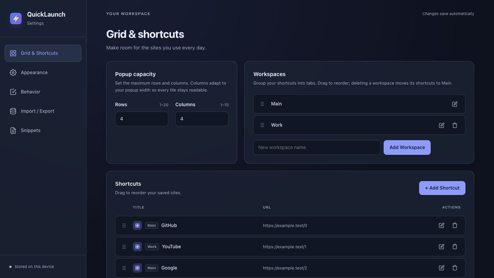
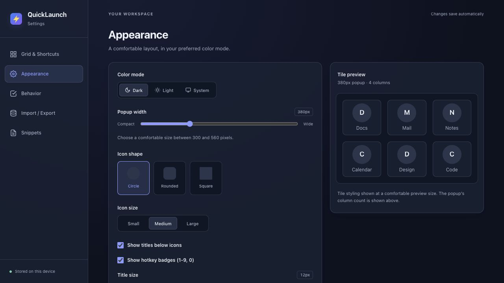
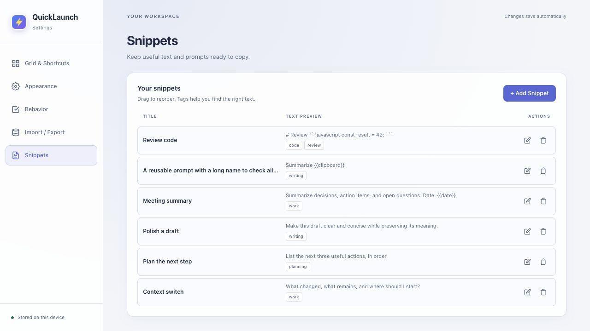
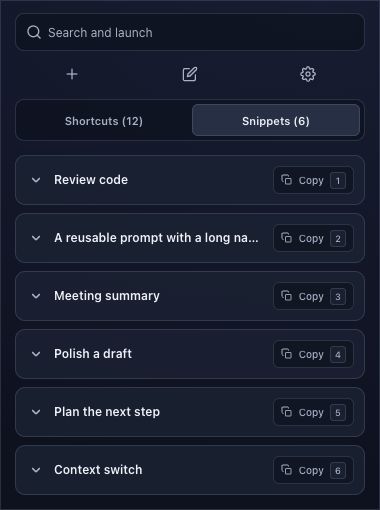
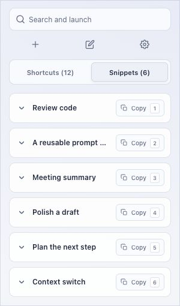
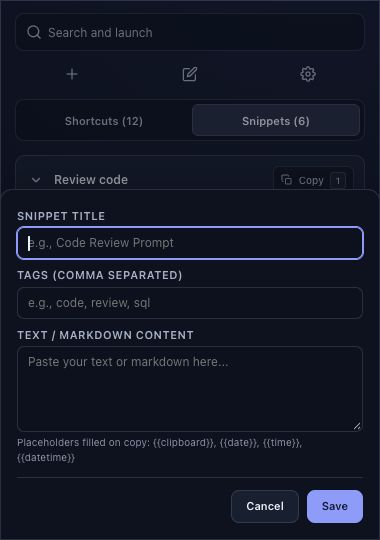

# QuickLaunch interface review and redesign

September 30, 2026. Implemented in the local 2.7 candidate. This supplements the [code and reliability review](REVIEW_2026-09-30.md). Existing user changes were preserved. No Store publication was performed.

This records the first full redesign checkpoint (46 tests, 23 packaged files). The subsequent [workflow follow-up](WORKFLOW_REVIEW_2026-09-30.md) records the 63-test/24-file workflow checkpoint. The later [conflict fix](STORAGE_CONFLICT_FIX_2026-09-30.md) records the current 68-test/25-file candidate and native Brave save verification.

## Problems found and fixed

| Problem | Result |
| --- | --- |
| Crowded popup toolbar left little space for search. | Full-width search row, evenly spaced action rail, and a separate segmented mode control. Both search-position preferences work. |
| Settings mixed unrelated spacing, control widths, type sizes, and surfaces. | Shared theme tokens, bounded content width, grouped cards, consistent fields/buttons, and a responsive navigation rail. Translucent panels, a blurred sidebar, and dialog backdrops retain the glass direction. |
| List headers and row actions used different column tracks. | Shared tracks and matching padding align shortcut/snippet columns. Long titles and URLs truncate without displacing actions. |
| Workspace rows contained a fourth empty cell after switching to three columns. | Removed the extra cell, keeping rename/delete actions on the same row. |
| The snippet drag overlay was not anchored to its row. | Each row now contains its drag overlay, preventing it from covering unrelated controls. |
| Snippet Copy text and a separate saturated number badge looked crowded. | One bordered icon/text action with a neutral keyboard keycap; equal control heights and stable title/action separation. |
| Popup editor could shrink until Save fell outside the visible area. | Editor overlays reserve sufficient popup height, scroll their form independently, and keep the action footer visible. Background actions are dimmed and blocked. |
| Popup edit buttons were nested inside launch links; editor focus could escape. | Edit tiles are named groups with accessible buttons. Dialogs contain Tab/Shift+Tab, Escape closes them, and focus returns to a trigger. Text fields and checkboxes have visible keyboard focus. |
| Motion combined old staggered entrances, indefinite edit jiggle, and broad transitions. | Coordinated, bounded transitions; steady edit/drag targets; explicit reduced-motion support. |
| Appearance preview did not report width-dependent column adaptation. | Summary uses the popup's fitting formula; spacing updates immediately. The compact tile sample is explicitly a styling preview. |
| Settings Import was a label around a hidden file input. | A keyboard-focusable Import button opens the existing file input. Clipboard help now matches 2.7's refusal to copy on permission/read failure. |

## Motion design

| Interaction | Behavior |
| --- | --- |
| Popup view/workspace change | 180ms opacity and 4px translation; earlier animation on that view is cancelled. |
| Settings section | 240ms opacity and 6px entrance. |
| Settings dialog / popup sheet | 220ms / 200ms entrance with slight translation and scale. |
| Snippet disclosure | 220ms grid expansion/collapse, 180ms opacity; collapsed contents are hidden from keyboard focus. |
| Shortcut hover | 2px lift with a 240ms restrained spring; disabled during edit/drag. |
| Snippet hover / button press | 1px lift / subtle scale feedback; no hover lift during drag. |
| Reduced motion | CSS animation/transitions disabled; JavaScript view animation skipped. |

No per-card entrance sequence or infinite jiggle remains active. Blur is limited to the Settings sidebar and modal backdrop; list rows and tiles do not add individual backdrop filters. This bounds effects, but real installed-extension startup and frame performance still need native profiling.

## Rendered verification

The real HTML/CSS/JavaScript was exercised in Chromium using synthetic extension APIs and sample records. The fixture never reads the user's installed extension storage or clipboard. Sample favicons use the extension logo.

- All five Settings sections inspected in dark and light at 1280×720. Controls, section headings, cards, and list actions were visually checked.
- All sections fit 640px and 420px viewports in both themes. At 640px, the content's client/scroll width was 576/576px; at 420px, 356/356px. No horizontal overflow. [Recorded light-theme measurements](visual-qa/ui-layout-checks.json).
- At desktop width, snippet header and row column origins matched exactly: **310.1875, 620.046875, 1125.8125px**. The drag overlay stayed within its row.
- Popup checked at **300, 380, and 560px**, including maximum requested columns, long titles, empty shortcuts, top/bottom search, snippet disclosure, shortcut editing and current-tab confirmation.
- Copy buttons measured **28px high**. At 300px the title ended 8px before the copy control; no overlap.
- Popup snippet editor at 300px and 380px: body **540px** high, Save bottom **523px**, with no horizontal form overflow. Shortcut editor also kept Save within the popup.
- Settings snippet dialog at a 420×800 viewport was **396px** wide, with Save bottom **677.25px**. Focus border reflected the light accent.
- Browser hover inspection showed the intended 2px tile lift. Expanded snippet content measured 141.03125px and used the specified grid transition. Emulated reduced motion produced `0s` transitions, no animation/transform, and hidden collapsed content.
- No warnings/errors were returned by the preview tabs' browser log checks.
- **46/46 regression tests pass**, including new focus containment, accessible edit controls, animation cancellation/reduced motion, and column adaptation checks. Syntax, references, manifest, and whitespace checks pass for the 23-file release allowlist.

These checks establish rendered layout and UI behavior. They do not certify Chrome's real clipboard permission prompts, cached favicons, operating-system notifications, popup dismissal, or MV3 worker lifecycle. The native upgrade and publication checklist remains in [STORE_RELEASE.md](../STORE_RELEASE.md).

## Redesign checkpoint screenshots

Other section/theme captures are stored alongside these files. Rebuild the candidate with `npm run package`; its current SHA and exact source parity record are linked from the [main review](REVIEW_2026-09-30.md).
