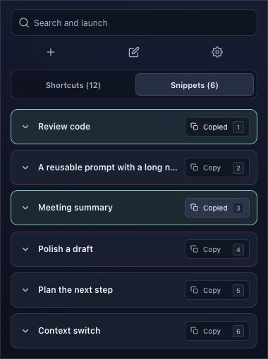
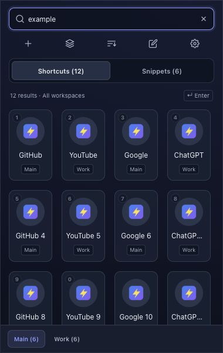
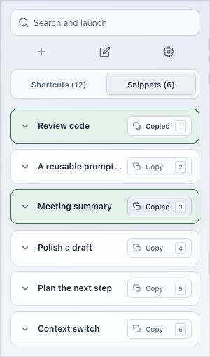
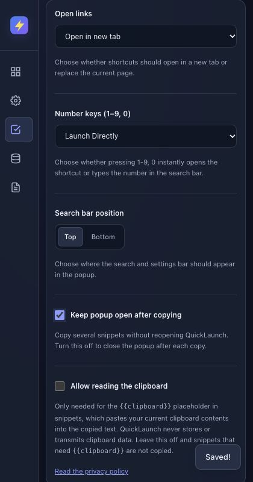

# QuickLaunch workflow follow-up

September 30, 2026. An additional code and rendered-UI review of the local 2.7 candidate. Existing work was preserved. No public upload, Store submission, or permission expansion was performed.

This records the 63-test/24-file workflow checkpoint. The later [storage-conflict fix](STORAGE_CONFLICT_FIX_2026-09-30.md) records the current 68-test/25-file candidate and successful native Brave saves.

## Improvements implemented

| Workflow | Change | Practical result |
| --- | --- | --- |
| Find a saved item | Shared relevance ranking in `search.js`: exact title/prefix, then weaker field matches; every query word must match, in any order. Accent/case/whitespace normalization. | Searching `code review` finds `Review code`. Matching terms can span a title and its tags or URL. Subsequence matching is limited to title/detail fields, while long bodies use literal matching. |
| Search across workspaces | Existing global shortcut search now shows a result count, “All workspaces” context, and a workspace label on each tile. Workspace names are searchable. | A Work result found while Main is selected is clearly identified before launch. Existing manual/A–Z/usage order is retained when relevance ties. |
| Use search from the keyboard | Enter uses the first freshly ranked result, Cmd/Ctrl+F focuses and selects search, and Escape clears the query. Empty searches offer Clear search. | Enter flushes pending input debounce, preventing launch/copy of the previous query's first item. No result means no launch or copy. |
| Copy several snippets | New **Behavior → Keep popup open after copying** preference, default off; validated persistence and backup support. | When enabled, each copied card briefly says Copied and a polite status announcement is emitted. Copy buttons retain their width and keyboard focus. When disabled, existing success-and-close behavior remains. |

Search stays local. Normalized fields are cached by item and invalidated after text/title/tag edits. Large body fields are normalized lazily only when they can affect a result. One ranked snippet list serves rendering, number keys, and Enter to keep visible results and keyboard actions consistent.

## Additional bugs corrected

- Typing from a focused shortcut previously moved focus to search but lost the first character; it now inserts that character. Alt/modified input does not trigger this behavior.
- Shortcut/snippet number badges now follow the enabled-badges and launch-key preferences, avoiding hints for keys configured to type into search.
- Pending clipboard expansion/write prevents concurrent copy attempts. Failure restores controls and focus, leaves the popup open, and does not schedule a close. A default-mode close timer also avoids dismissing a newly opened editor.
- Copied labels use a fixed-width slot, eliminating Copy/Copied layout shifts. Repeated-copy success uses card feedback instead of covering the next action with a toast.
- Long popup errors wrap within the actual popup body. Expired toasts now leave the accessibility tree after their fade, avoiding invisible stale error text.
- Storage recovery keeps Tab/Shift+Tab on Reload; an underlying editor cannot steal recovery focus.
- Switching the OS preference to reduced motion immediately cancels active view animations, rather than only affecting future transitions.
- Inactive snippet rendering cannot replace the active shortcut search status after an import.

## Verification

- **63/63 regression tests pass**, including ranked search, multiple fields/words, accents, stable ordering, cache invalidation, Enter/number consistency, first-character input, no-result recovery, copy concurrency/failure, close timing, setting persistence/validation, focus recovery, and live reduced-motion changes.
- Syntax, local references, manifest, and whitespace checks pass. The allowlisted release now contains **24 files**, including `search.js`; fixtures, benchmark scripts, tests, screenshots, and dependencies remain excluded. The current archive hash is recorded in the [main review](REVIEW_2026-09-30.md) and `dist/quicklaunch-v2.7.sha256`.
- Chromium rendered the actual extension UI with synthetic storage and clipboard adapters. At **300px**, Copy/Copied controls were **92×28px**, with an **8px** gap after the title. Keyboard focus returned to the Copy button after repeat copies. Error feedback occupied **272px**, from x=14 to x=286, and disappeared from the accessibility snapshot after expiry.
- At **380px**, global results identified both Main and Work while Main stayed selected. Result count and Enter hint fit above the scrollable list.
- Browser input confirmed reversed-word snippet search, Enter copy without closing, Escape reset, first-character retention, and Cmd+F search selection. Preview browser logs returned no warnings/errors.
- Updated Behavior settings fit **640px and 420px** viewports with document scroll width equal to viewport width. The new checkbox, explanatory text, and focus treatment were visually checked.

Synthetic adapters do not read installed extension storage or the user's clipboard. These checks do not establish real clipboard permission UX, popup dismissal, native launch behavior, upgrade preservation, or MV3 worker lifecycle. The normal-Chrome release gates in [STORE_RELEASE.md](../STORE_RELEASE.md) still apply.

## Search performance

Run `node scripts/benchmark-search.cjs`. One sequential Node run on this machine used 200 snippets with **5.30 MiB** of body text:

| Operation | Elapsed |
| --- | ---: |
| First title-focused query, body index left lazy | 0.93 ms |
| First body query, including normalization | 42.85 ms |
| 70 subsequent queries against the cache | 105.08 ms total (about 1.5 ms/query) |

This measures the ranking code only, excluding browser rendering, extension startup, storage, and clipboard operations. The first body search still incurs indexing cost; native startup/typing/frame profiling is required before claiming installed-extension speed. No quantitative comparison with another build is claimed.

## Next feature priorities

1. **Undo deletion** is the highest-value next feature: recover an accidentally removed shortcut/snippet without finding an old backup. Design bounded recovery retention, stable item identity, and conflict-safe restoration before implementation; reset behavior should also clear that retained content.
2. **Filter the Settings lists** for users managing large collections. Keep full collection identity/order for edits and imports while filtering the visible list; ensure drag ordering is explicit when a filter is active.
3. **Reduce unnecessary reload conflicts** through stable shortcut IDs and record-level updates, followed by live external-change refresh. This is a storage-model change and deserves separate migration/upgrade testing.
4. Measure **native startup and scrolling** before adding lazy library loading or list virtualization. Favor these measured improvements over additional decorative motion.

The implemented search and repeated-copy additions address common workflows without introducing new permissions or a data migration. Undo and concurrent-edit changes should be separate, reviewable work.

## Current rendered evidence

Synthetic sample data, not the installed Store extension.

